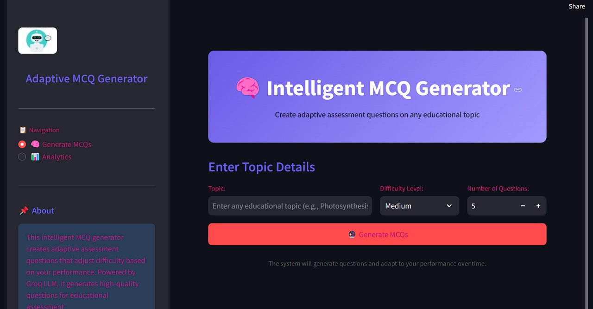

```markdown
# 🎯 Adaptive MCQ Generator

An intelligent MCQ generation system that transforms educational content into engaging assessment tools. The system automatically generates questions with varying difficulty levels based on user performance and provides detailed analytics and explanations.

## 🚀 Features

- **AI-Powered Question Generation**: Automatically generates relevant MCQs from educational topics using Groq LLM 🤖
- **Adaptive Difficulty**: Questions adjust based on user performance patterns 🔄
- **Comprehensive Analytics**: Track progress and identify areas for improvement with interactive visualizations 📊
- **Detailed Explanations**: Get explanations for correct answers to enhance learning 💡
- **User-Friendly Interface**: Clean, intuitive, and attractive design for easy navigation ✨

## 🛠️ Setup Instructions

### Local Development

1. **Clone this repository:**
   ```bash
   git clone <your-repository-url>
   cd adaptive-mcq-generator
   ```
2. **Install dependencies:**
   ```bash
   pip install -r requirements.txt
   ```
3. **Create a `.env` file in the root directory and add your Groq API key:**
   ```bash
   GROQ_API_KEY=your_groq_api_key_here
   ```
   Get your API key by signing up at [Groq Console](https://console.groq.com/) 🌐

4. **Run the application:**
   ```bash
   streamlit run app.py
   ```

### Deploying to Streamlit Cloud

1. **Push your code to GitHub:**
   ```bash
   git add .
   git commit -m "Initial commit"
   git push origin main
   ```
2. **Go to [Streamlit Cloud](https://streamlit.io/cloud)**
3. **Click "New app" and select your repository**
4. **Add your Groq API key as a secret in the Streamlit Cloud dashboard:**
   - **Name:** `GROQ_API_KEY`
   - **Value:** `your_groq_api_key_here`
5. **Deploy the app 🚀**

## 📝 Usage

1. **Enter an educational topic in the text field**
2. **Select difficulty level and number of questions**
3. **Click "Generate MCQs" to create questions on the topic**
4. **Answer the questions one by one**
5. **Review your performance analytics and explanations**
6. **Track your progress over time in the Analytics section**

## 🔧 Technologies Used

- **Streamlit**: Web interface and deployment 💻
- **Groq LLM (Llama 3 70B)**: AI-powered question generation 🤖
- **LangChain**: Framework for working with LLMs 🔗
- **Plotly and Matplotlib**: Interactive data visualizations 📈
- **Pandas**: Data analysis and manipulation 🐼

## 📸 Screenshots

### Chatbot Dashboard


### Scorecard Overview


### Score Questions Breakdown


## 📜 Creator
This project was made By  **Nandesh Kalashetti**.
```
